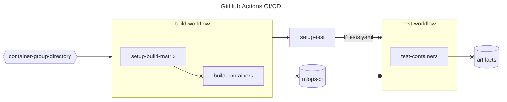

# Container Pipeline Format

## Folder Structure

```txt
container-group
├── .actions.json
├── recipe_1
│   ├── Dockerfile
│   ├── my_script.py
│   └── tests.yaml
├── recipe_2
│   ├── Dockerfile
│   └── tests.yaml
├── recipe_3
│   └── Dockerfile
└── docker-compose.yaml
```

## CI/CD



### .actions.json

This file contains the ENV Variation Scheme used to create a Matrix in GitHub Actions. For example, utilizing two version of python or OS.

```json
{
    "PYTHON_VERSION": ["python3.9", "python3.10"],
    "experimental": [true]
}
```

This file is required, and if there are no variations, simply use the following:

```json
{
    "VARIATION": ["NONE"],
    "experimental": [true]
}
```

>Note that `experimental: [true]` is required for `fail-fast` to function. See [Docs](https://docs.github.com/en/actions/using-jobs/using-a-matrix-for-your-jobs#handling-failures) for more information.

### tests.yaml

This file contains the tests to validate each container in a given recipe. Here is an example for PyTorch:

```yaml
pytorch-pip-base:
    image_name: ${REGISTRY}/aiops/mlops-ci:b-${GITHUB_RUN_NUMBER:-0}-${BASE_IMAGE_NAME:-ubuntu}-${BASE_IMAGE_TAG:-22.04}-pip-py${PYTHON_VERSION:-3.10}-ipex-${IPEX_VERSION:-2.0.0}-base
    tests:
    - test_name: ipex-resnet50
      cmd: python pytorch/tests/ipex-resnet50.py
pytorch-idp-base:
    image_name: ${REGISTRY}/aiops/mlops-ci:b-${GITHUB_RUN_NUMBER:-0}-${BASE_IMAGE_NAME:-ubuntu}-${BASE_IMAGE_TAG:-22.04}-idp-py${PYTHON_VERSION:-3.10}-ipex-${IPEX_VERSION:-2.0.0}-base
    tests:
    - test_name: ipex-resnet50
      cmd: python pytorch/tests/ipex-resnet50.py

```

Example Test:

```bash
# After Build and Pushing Image
# From Repo Root Directory
$ python -m pip install -r .github/utils/requirements.txt
$ python .github/utils/test_runner.py --tests-yaml /path/to/tests.yml
```

### docker-compose.yaml

For each service in your composefile, define a recipe to publish. Pipeline recipes with validation requirements should have a tests.yaml file for each service, and the given recipe's folder contains both the Dockerfile and the tests.yaml file required to validate.

Composefiles should also have smoke test validation to ensure that important packages can print their version.

```yaml
services:
  my_recipe_1:
    build:
      args: 
        http_proxy: ${http_proxy}
        https_proxy: ${https_proxy}
        no_proxy: ""
        BASE_IMAGE_NAME: ${BASE_IMAGE_NAME:-ubuntu}
        BASE_IMAGE_TAG: ${BASE_IMAGE_TAG:-22.04}
        PYTHON_VERSION: ${PYTHON_VERSION:-3.10}
      context: ./recipe_1
      target: my_stage_1
    command: >
      bash -c 'python --version'
    image: ${REGISTRY}/aiops/mlops-ci:b-${GITHUB_RUN_NUMBER:-0}-${BASE_IMAGE_NAME:-ubuntu}-${BASE_IMAGE_TAG:-22.04}-my_recipe_1-py${PYTHON_VERSION:-3.10}-base
    pull_policy: always
  my_recipe_2:
    build:
      context: ./recipe_2
      target: my_stage_2
    extends: my_recipe_1
    image: ${REGISTRY}/aiops/mlops-ci:b-${GITHUB_RUN_NUMBER:-0}-${BASE_IMAGE_NAME:-ubuntu}-${BASE_IMAGE_TAG:-22.04}-my_recipe_2-py${PYTHON_VERSION:-3.10}-base
```

Example Test on Host:

```bash
# container-group-directory
$ PYTHON_VERSION=3.9 docker compose up --build 
```

#### Tips and Tricks

* Use `extends` to better reuse code
* When using ENV Variables, give them a default by doing `${MY_VAR:-my_default_val}`
* Use `bash -c` in the command `spec` to be able to chain smoke test commands together with `&&`
* See an [Example](../pytorch/) and it's [CI](workflows/build-all.yml)

### Dockerfile

Each Dockerfile should contain the recipes to build one or more containers.

#### Tips and Tricks

* https://cloud.google.com/architecture/best-practices-for-building-containers
* https://docs.docker.com/develop/develop-images/dockerfile_best-practices/
* https://docs.docker.com/build/building/multi-stage/#:~:text=With%20multi%2Dstage%20builds%2C%20you,want%20in%20the%20final%20image.
