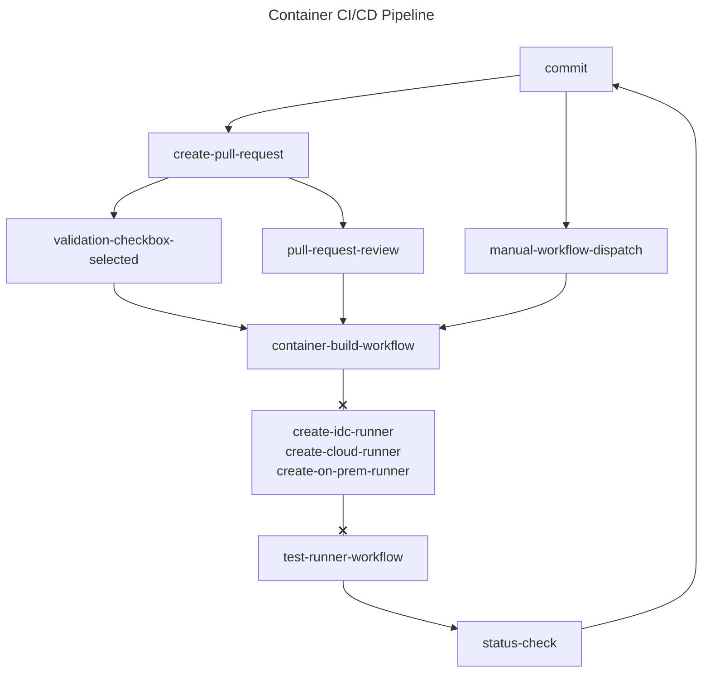

# Container Pipeline Format

Docker Containers allow for creating isolated and controlled environments that enable AI solutions to run anywhere. However, before publishing that container environment, each use-case component for that container needs to be tested and validated to produce the expected results and performance that component would offer in any other environment. The Container Pipeline Format allows for a Production Container Pipeline of Intel® Components to be packaged accurately and efficiently. For pipelines that require multiple dimensions or variations of their package or operating system versions the Container Pipeline Format supports dynamic matrix creation via GitHub Actions. Likewise, testing can be independently parallelized using the [test-runner](../test-runner/README.md) application and GitHub Actions.

## Folder Structure

```txt
container-group
├── .actions.json
├── recipe_1
│   ├── Dockerfile
│   ├── my_script.py
│   └── tests.yaml
├── recipe_2
│   ├── Dockerfile
│   └── tests.yaml
├── recipe_3
│   └── Dockerfile
└── docker-compose.yaml
```

## CI/CD

The Intel® AI Containers repo uses the below format along with the [Container Pipeline Tester GitHub Action Workflow](./workflows/container-pipeline-tester.yaml) to produce a majority of the containers found in the [Intel® AI Containers Landing Page]().



### Composite Action

This action builds and pushes containers using docker compose to a give container registry, and allows customization with environment variables.

Inputs for the action:

```yaml
inputs:
  group_dir:
    description: 'Directory with docker-compose.yaml to build'
    required: true
    type: string
  env_overrides:
    description: 'Bash Env Variable Overrides in `KEY=VAL && KEY2=VAL2` format'
    required: false
    type: string
  registry:
    description: 'Container Registry URL'
    required: true
    type: string
```

Example Implementation of the action:

```yaml
build-containers:
  container:
    image: ${{ vars.REGISTRY }}/aiops/compose-dev:latest
    env:
      http_proxy: ${{ secrets.HTTP_PROXY }}
      https_proxy: ${{ secrets.HTTPS_PROXY }}
      no_proxy: ${{ secrets.NO_PROXY }}
    credentials:
      username: ${{ secrets.REGISTRY_USER }}
      password: ${{ secrets.REGISTRY_TOKEN }}
  env:
    MY_OVERRIDE: OVERRIDE_VALUE
  runs-on: [ builder ]
  steps:
    - uses: actions/checkout@v4
    - uses: docker/login-action@v3
      with:
        registry: ${{ vars.REGISTRY }}
        username: ${{ secrets.REGISTRY_USER }}
        password: ${{ secrets.REGISTRY_TOKEN }}
    - name: Build Container Group
      uses: intel/ai-containers/.github@main
      with:
        group_dir: /path/to/group/dir
        registry: ${{ vars.REGISTRY }}
```

### .actions.json

This file contains the ENV Variation Scheme used to create a Matrix in GitHub Actions for the Container Build Action. In this example it can create a matrix to build a container group with different python versions:

```json
{
    "PYTHON_VERSION": ["python3.9", "python3.10"],
    "experimental": [true]
}
```

This file is required for the Container Pipeline Tester, and if there are no variations, simply use the following:

```json
{
    "VARIATION": ["NONE"],
    "experimental": [true]
}
```

>Note that `experimental: [true]` is required for `fail-fast` to function. See [Docs](https://docs.github.com/en/actions/using-jobs/using-a-matrix-for-your-jobs#handling-failures) for more information.

>Note that json format is used because the file is directly translated to the Actions environment as `matrix: ${{ fromJson(needs.setup-build-matrix.outputs.matrix) }}` and `env: ${{ matrix }}`. Since yaml and other configuration formats get translated into json anyways, we use json to avoid potentially altering the sensitive json formatting that the action is expecting.

### docker-compose.yaml

For each service in your composefile, define a recipe to publish. Pipeline recipes with validation requirements should have a tests.yaml file for each service, and the given recipe's folder contains both the Dockerfile(s) and the tests.yaml file(s) required to validate.

Composefiles should also have smoke test validation to ensure that important packages can print their version.

```yaml
services:
  my_recipe_1:
    build:
      args: 
        http_proxy: ${http_proxy}
        https_proxy: ${https_proxy}
        no_proxy: ""
        BASE_IMAGE_NAME: ${BASE_IMAGE_NAME:-ubuntu}
        BASE_IMAGE_TAG: ${BASE_IMAGE_TAG:-22.04}
        PYTHON_VERSION: ${PYTHON_VERSION:-3.10}
      context: ./recipe_1
      target: my_stage_1
    command: >
      bash -c 'python -m my_package --version'
    image: ${REGISTRY}/aiops/mlops-ci:b-${GITHUB_RUN_NUMBER:-0}-${BASE_IMAGE_NAME:-ubuntu}-${BASE_IMAGE_TAG:-22.04}-my_recipe_1-py${PYTHON_VERSION:-3.10}-base
    pull_policy: always
  my_recipe_2:
    build:
      context: ./recipe_2
      target: my_stage_2
    extends: my_recipe_1
    image: ${REGISTRY}/aiops/mlops-ci:b-${GITHUB_RUN_NUMBER:-0}-${BASE_IMAGE_NAME:-ubuntu}-${BASE_IMAGE_TAG:-22.04}-my_recipe_2-py${PYTHON_VERSION:-3.10}-base
```

Example Test on Host:

```bash
# container-group-directory
$ PYTHON_VERSION=3.9 docker compose up --build 
```

#### Tips and Tricks

* Use `extends` to better reuse code
* When using ENV Variables, give them a default by doing `${MY_VAR:-my_default_val}`
* Use `bash -c` in the command `spec` to be able to chain smoke test commands together with `&&`
* See an [Example](../pytorch/docker-compose.yaml)
