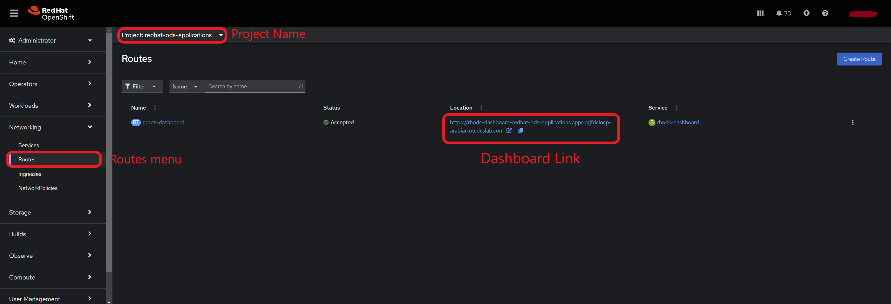
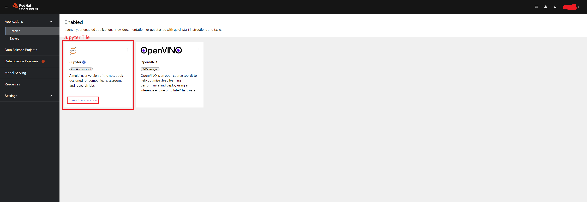
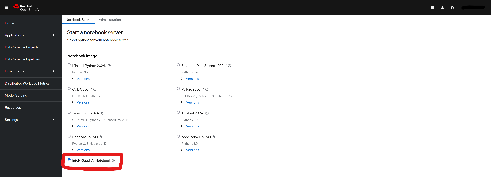
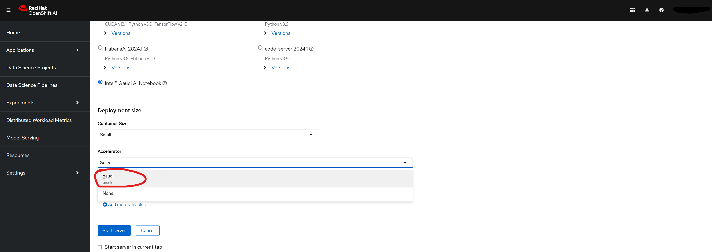

# Intel® Gaudi AI Software Tools Containers on OpenShift AI

Intel® Gaudi AI Software Tools for OpenShift AI(RedHat OpenShift Data Science/RHODS) is a suite of containers that enables the AI practitioners to utilize Intel® Gaudi accelerator for AI workflows on OpenShift platforms. You can access these containers using the RHODS Jupyter dashboard. More details about each container is described in the table below.

## Gaudi Notebook Containers

| Notebook Container Name | Tools | Image Name |
| -----------------------------| ------------- | ------------- |
| Intel Gaudi Notebook Container 1.17.0-495 | [Intel® Gaudi Software Stack*](https://docs.habana.ai/en/latest/Installation_Guide/Bare_Metal_Fresh_OS.html), [Intel® Gaudi PyTorch](https://docs.habana.ai/en/latest/PyTorch/index.html), [Intel® Gaudi vLLM](https://github.com/HabanaAI/vllm-fork.git), [Intel® Gaudi DeepSpeed](https://github.com/HabanaAI/DeepSpeed) | [`registry.connect.redhat.com/intel/gaudi-notebooks:1.17.0-495-rhel-9.2`](registry.connect.redhat.com/intel/gaudi-notebooks@sha256:a62baf968caa7dd23b7f4cdcddc26e109d894f1436e247b4ea1e2fb4a5c94d54) |
| Intel Gaudi Notebook Container 1.17.1-40 | [Intel® Gaudi Software Stack*](https://docs.habana.ai/en/latest/Installation_Guide/Bare_Metal_Fresh_OS.html), [Intel® Gaudi PyTorch](https://docs.habana.ai/en/latest/PyTorch/index.html), [Intel® Gaudi vLLM](https://github.com/HabanaAI/vllm-fork.git), [Intel® Gaudi DeepSpeed](https://github.com/HabanaAI/DeepSpeed) | [`registry.connect.redhat.com/intel/gaudi-notebooks:1.17.1-40-rhel-9.2`](registry.connect.redhat.com/intel/gaudi-notebooks@sha256:00ca535956b7fcdd91e71bc4a3cd4493ddcaceea9b8d7bb95a7edc0e1cb0bac4) |

## Run Gaudi Notebook Containers

You can access the Intel® Gaudi AI SW Tools containers from OpenShift* AI dashboard.

### Prerequisite

1. Make sure you have access to [OpenShift* Container Platform](https://docs.openshift.com/container-platform/4.14/installing/index.html) and [OpenShift* AI operator](https://docs.redhat.com/en/documentation/red_hat_openshift_ai_cloud_service/1/html/installing_and_uninstalling_openshift_ai_cloud_service/installing-and-deploying-openshift-ai_install#installing-and-deploying-openshift-ai_install) is installed if you want to access the containers from OpenShift* AI dashboard.

2. To utilize the Intel® Gaudi accelerator with the notebook please, install the Intel® Gaudi Base Operator for OpenShift([instructions](https://catalog.redhat.com/software/container-stacks/detail/6683b2cce45daa25e36bddcb)) and the accelerate profile using the following command on your machine connected to the OCP cluster. You need to be logged into the OCP cluster for this command to work.

    ```bash
    oc apply -f https://raw.githubusercontent.com/intel/intel-technology-enabling-for-openshift/main/e2e/inference/accelerator_profile_gaudi.yaml
    ```

3. Install the [Intel® Gaudi AI SW Tool Operator](https://catalog.redhat.com/software/container-stacks/detail/66d7aa630eb66a02febc8103).

4. Create the CRD to install Gaudi notebook into OpenShift AI Jupyter dashboard using following command.

    ```bash
    oc apply -f https://raw.githubusercontent.com/intel/ai-containers/main/enterprise/redhat/openshift-ai/gaudi/crd-sample.yaml
    ```

### Start the jupyter notebook from RHODS dashboard

To access the jupyter notebook from the jupyter server running inside the Gaudi notebook container in OpenShift AI follow the steps below.

1. Once the OpenShift AI operator is installed correctly, you can access the dashboard by following the instructions below.

    1. Go to the *Routes* menu in your OCP console in the menu left side in the *Networking* tab.

    2. Select the project as `redhat-ods-applications` from the menu at the top.

    3. You will see list of all the routes available to you in the project. You will also see the corresponding link to access the routes. Please select the link in the row named *rhods-dashboard* as shown in the picture. This will take you to the OpenShift AI dashboard. Please refer to the screenshot below for more details.

        

2. Once on the OpenShift AI dashboard you can select the link to `Launch Application` inside the *Jupyter* tile in the *Enabled* applications from the left menu. Please refer to the screenshot below for more details.

    

3. If you've followed step 3 in [prerequisites](#prerequisite) to import images you should be able to see the Intel® Gaudi AI Software Tools images in the dashboard as shown in the screenshot below.

    

4. Select the size of the resources you want to request from the dropdown menu *Container Size*. The options available are `Small`, `Medium`, `Large`, `X-Large`. The sizes describes the request of resources like CPU, RAM and Disk Space for the jupyter server container.

5. (*Optional*) To utilize the Intel® Gaudi accelerators select the accelerator profile from the dropdown menu as shown in the screenshot below.

    

6. Once all options are selected click on the *Start Server* button to start the jupyter server.

## Troubleshooting and Support

If you need more help feel free to submit an [issue](https://github.com/intel/ai-containers/issues).

---
\* Other names and brands may be claimed as the property of others. Trademarks
