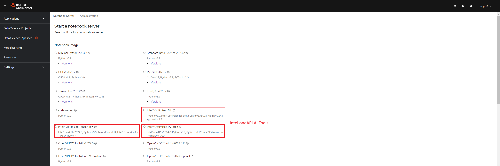
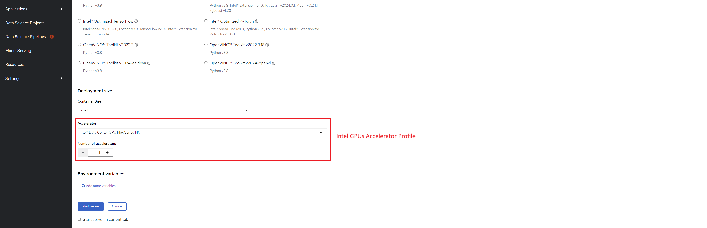

# Intel® oneAPI AI Tools Containers on OpenShift AI

Intel® oneAPI AI Tools for OpenShift AI(RedHat OpenShift Data Science/RHODS) is a suite of containers that enables the AI practitioners to utilize Intel® hardware for AI workflows on OpenShift platforms. You can access these containers using the RHODS Jupyter dashboard. More details about each container is described in the table below.

## AI Tools Containers

| Preset Container Name | Tools | Image Name |
| -----------------------------| ------------- | ------------- |
| Intel Optimized Machine Learning | [Modin*](https://github.com/modin-project/modin), [Intel® Data Connector](https://github.com/IntelAI/models/tree/master/datasets/cloud_data_connector) | [`quay.io/opendatahub/workbench-images:jupyter-intel-ml-ubi9-python-3.9-20240404`](https://quay.io/repository/opendatahub/workbench-images/manifest/sha256:90e6a0688d007a90809cb0869a9c0bfeb7db1d2f38ed97ccfb37b1e4d3dcefaf) |
| Intel Optimized PyTorch | [PyTorch*](https://pytorch.org/), [Intel® Extension for PyTorch](https://github.com/intel/intel-extension-for-pytorch), [Intel® Data Connector](https://github.com/IntelAI/models/tree/master/datasets/cloud_data_connector), [Intel® Neural Compressor](https://github.com/intel/neural-compressor) | [`quay.io/opendatahub/workbench-images:jupyter-intel-pytorch-ubi9-python-3.9-20240404`](https://quay.io/repository/opendatahub/workbench-images/manifest/sha256:5571a6fb43e18a00188e52a0468e1e65f0a0234230089b06f65ea9d1791fe191) |
| Intel Optimized TensorFlow | [Tensorflow*](https://www.tensorflow.org/), [Intel® Extension for Tensorflow](https://github.com/intel/intel-extension-for-tensorflow),<br /> [Intel® Neural Compressor](https://github.com/intel/neural-compressor), [Intel® Data Connector](https://github.com/IntelAI/models/tree/master/datasets/cloud_data_connector) | [`quay.io/opendatahub/workbench-images:jupyter-intel-tensorflow-ubi9-python-3.9-20240404`](https://quay.io/repository/opendatahub/workbench-images/manifest/sha256:62cf26e31b87b766a3863520dc28e82e267dbf0e8eca8a1a4f031839953a321a) |

## Run AI Tools Containers

You can access the Intel® oneAPI AI Tools containers from OpenShift* AI dashboard.

### Prerequisite

1. Make sure you have access to [OpenShift* Container Platform](https://docs.openshift.com/container-platform/4.13/installing/index.html) and [OpenShift* AI operator](https://access.redhat.com/documentation/en-us/red_hat_openshift_ai_self-managed/2.5/html/installing_and_uninstalling_openshift_ai_self-managed/overview-of-deploying-openshift-ai_install) is installed if you want to access the containers from OpenShift* AI dashboard.

2. (*Optional*) If you want to utilize the Intel® Flex/Max GPU with the notebook please, install the Intel® Device Plugin for OpenShift([instructions](https://github.com/intel/intel-technology-enabling-for-openshift/blob/main/README.md#provisioning-intel-hardware-features-on-rhocp)) and the accelerate profile using the following command on your machine connected to the OCP cluster. You need to be logged into the OCP cluster for this command to work.

    ```bash
    oc apply -f https://raw.githubusercontent.com/intel/intel-technology-enabling-for-openshift/main/e2e/inference/accelerator_profile.yaml
    ```

3. Import the Intel AI Tools containers from quay workbench registry of opendatahub ([link](https://quay.io/repository/opendatahub/workbench-images?tab=tags&tag=latest)) to your cluster by applying the image manifests.

    ```bash
    oc apply -f https://raw.githubusercontent.com/intel/ai-containers/main/enterprise/redhat/openshift-ai/manifests/intel-optimized-pytorch.yaml
    oc apply -f https://raw.githubusercontent.com/intel/ai-containers/main/enterprise/redhat/openshift-ai/manifests/intel-optimized-tensorflow.yaml
    oc apply -f https://raw.githubusercontent.com/intel/ai-containers/main/enterprise/redhat/openshift-ai/manifests/intel-optimized-ml.yaml
    ```

### Start the jupyter notebook from RHODS dashboard

To access the jupyter notebook from the jupyter server running inside the AI Tools container in OpenShift AI follow the steps below.

1. Once the OpenShift AI operator is installed correctly, you can access the dashboard by following the instructions below.

    1. Go to the *Routes* menu in your OCP console in the menu left side in the *Networking* tab.

    2. Select the project as `redhat-ods-applications` from the menu at the top.

    3. You will see list of all the routes available to you in the project. You will also see the corresponding link to access the routes. Please select the link in the row named *rhods-dashboard* as shown in the picture. This will take you to the OpenShift AI dashboard. Please refer to the screenshot below for more details.

        

2. Once on the OpenShift AI dashboard you can select the link to `Launch Application` inside the *Jupyter* tile in the *Enabled* applications from the left menu. Please refer to the screenshot below for more details.

    

3. If you've followed step 3 in [prerequisites](#prerequisite) to import images you should be able to see the Intel® AI Tools images in the dashboard as shown in the screenshot below.

    

4. Select the size of the resources you want to request from the dropdown menu *Container Size*. The options available are `Small`, `Medium`, `Large`, `X-Large`. The sizes describes the request of resources like CPU, RAM and Disk Space for the jupyter server container.

5. (*Optional*) If you want to utilize the Intel® Flex/Max GPUs select the accelerator profile from the dropdown menu as shown in the screenshot below.

    

6. Once all options are selected click on the *Start Server* button to start the jupyter server.

## Troubleshooting and Support

If you need more help feel free to submit an [issue](https://github.com/intel/ai-containers/issues).

---
\* Other names and brands may be claimed as the property of others. Trademarks
